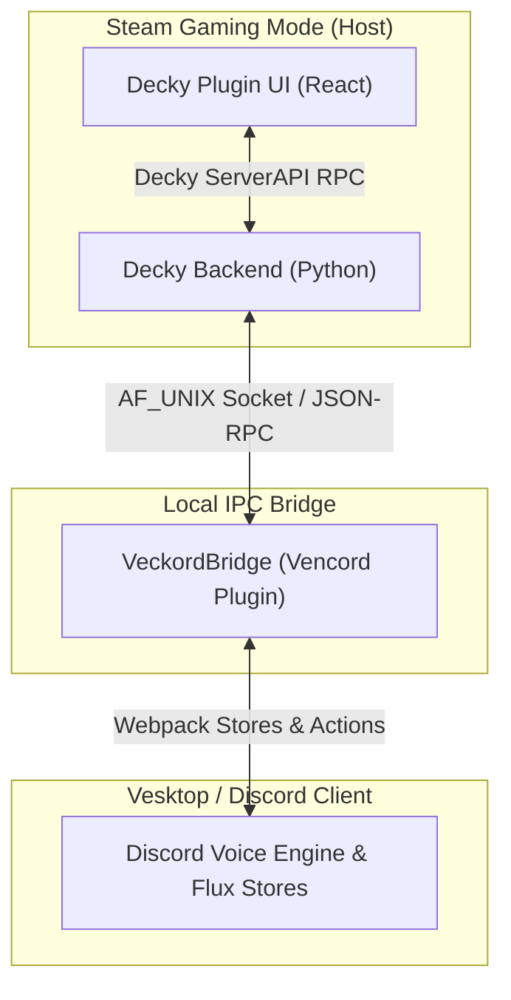

# Veckord

> Controller-native Decky Loader plugin for controlling Discord voice channels in Gaming Mode via a local Vesktop/Vencord bridge.

[](https://opensource.org/licenses/MIT)
[](https://github.com/SteamDeckHomebrew/decky-loader)
[](https://github.com/Vencord/Vesktop)

**Veckord** allows Steam Deck and Handheld PC gamers running Steam Gaming Mode (Bazzite, SteamOS) to seamlessly view, join, mute, deafen, and manage Discord voice channels directly from the Decky QAM (Quick Access Menu) overlay all on controller.

---

## Features

- **Controller Based UI**
- **Audio Controls**:
  - Active voice channel card showing connected server, channel, and live voice status.
  - One-tap controller actions: **Mute / Unmute**, **Deafen / Undeafen**, and **Disconnect**.
- **Favorites System**: Save your most used voice channels, reorder them, and join instantly from the QAM.
- **Zero Audio Overhead**: Veckord controls voice state via client RPC—it does **not** transport audio or run a separate voice stack.
- **Privacy First**: Runs entirely over local Unix domain sockets (`AF_UNIX`). No external servers, no token tracking, no cloud telemetry.

---

## Architecture



---

## Requirements

1. **Hardware / OS**: Steam Deck or Linux Gaming Handheld running Steam Gaming Mode (SteamOS, Bazzite, ChimeraOS).
2. **Decky Loader**: Installed and working ([decky.xyz](https://decky.xyz)).
3. **Vesktop / Vencord**: Flatpak or native Vesktop / Vencord running Discord.

---

## Installation & Setup

### Step 1: Install Vencord Bridge Plugin
1. Copy the `vencordBridge` directory into your Vencord userplugins directory:
   - **Vesktop Flatpak**: `~/.var/app/dev.vencord.Vesktop/config/vesktop/vencord/src/userplugins/veckordBridge`
2. Enable `VeckordBridge` in Vencord Plugin Settings inside Vesktop.
3. Restart Vesktop.

### Step 2: Install Decky Plugin
1. Download the latest `veckord.zip` release from [Releases](https://github.com/mattytacos/veckord/releases).
2. Extract or install via Decky Loader plugin developer menu into `~/homebrew/plugins/Veckord`.
3. Restart Decky Loader service (`sudo systemctl restart plugin_loader`).

---

## Building from Source

### Prerequisites
- Node.js 20+ & `pnpm`
- Python 3.10+

### Build Decky Frontend & Backend
```bash
# Clone repository
git clone https://github.com/mattytacos/veckord.git
cd veckord

# Install dependencies
pnpm install

# Build frontend bundle
pnpm build
```

### Build Vencord Bridge Plugin
To build the Vencord bridge plugin, place `vencordBridge/` into a clone of [Vencord](https://github.com/Vendicated/Vencord) under `src/userplugins/veckordBridge/` and build Vencord:
```bash
git clone https://github.com/Vendicated/Vencord.git
cp -r /path/to/veckord/vencordBridge Vencord/src/userplugins/veckordBridge
cd Vencord
pnpm install
pnpm build
```

### Run Backend Unit Tests
```bash
python3 -m unittest discover tests
```

---

## Troubleshooting

| Issue | Cause | Solution |
| :--- | :--- | :--- |
| **"Bridge unavailable"** | Vesktop is not running or `VeckordBridge` is disabled. | Launch Vesktop and verify `VeckordBridge` is enabled in Vencord plugins. |
| **"Not connected to voice"** | User has not joined a voice channel. | Select a voice channel from Favorites or the Channel Browser and press Join. |
| **Flatpak Socket Access** | Flatpak sandbox restricting socket access. | Verify `/run/user/<uid>/veckord/bridge.sock` permission mode is `0755`. |

---

## Privacy & Security

- **Local IPC Only**: All communications remain on local Unix domain stream sockets (`/run/user/<uid>/veckord/bridge.sock`).
- **No Token Storage**: Veckord does not read, request, or store your Discord account token or password.
- **Log Sanitization**: Logs automatically redact all personal IDs and credentials.

---

## Disclaimer & License

> **Important**: Veckord is an independent open-source project created by **mattytacos** and is **not** affiliated with, endorsed by, or sponsored by Discord Inc., Vencord, Vesktop, Valve Corporation, or Decky Loader.

Distributed under the [MIT License](LICENSE).
